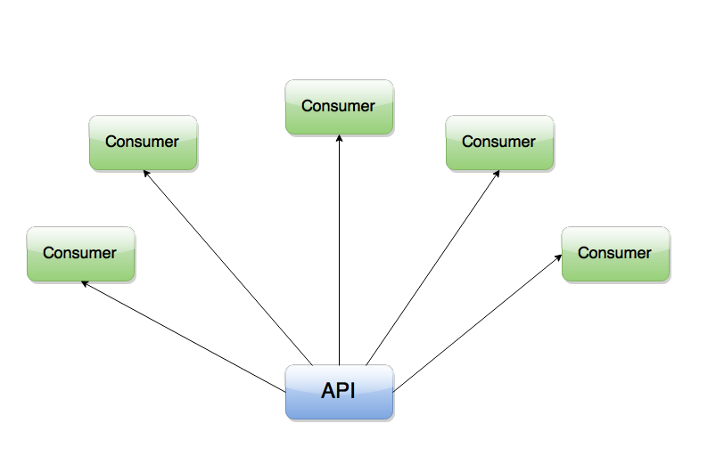
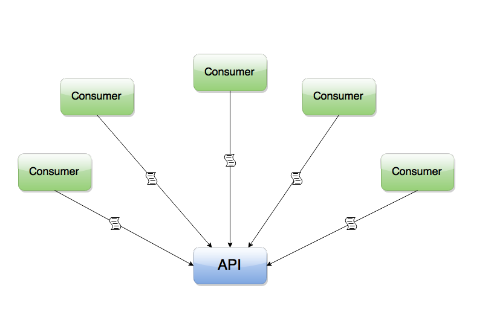
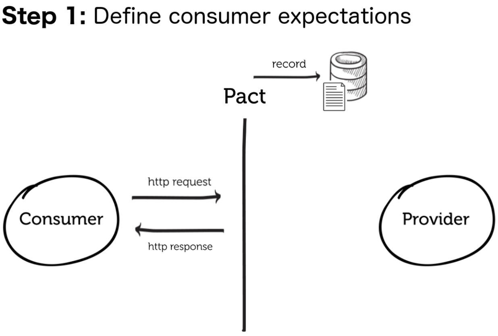
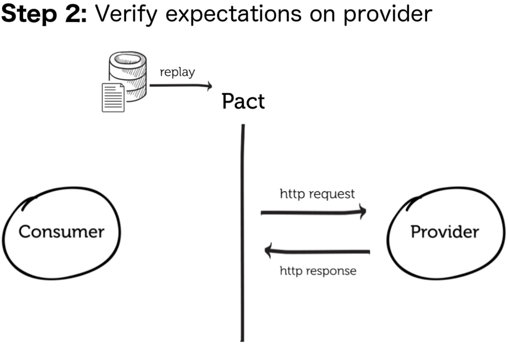
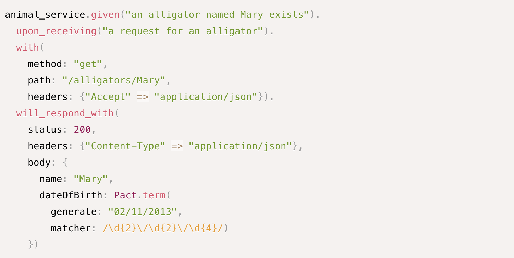

@title[Contracts Test]
## Contracts Test
##### Deploy with confidence

---
@title[Simple Scenario]

## Simple Scenario
Weekend. |
3AM

+++
@title[Go Fullscreen]

## Support called the on-call person!
Problem in *PHP API*   
On-call deployed a **Hotfix** affecting the API output.

+++

## Disaster!
iOS app not retreiving ads.

+++
@title[How]

#### How ?

 

Each *Consumer* expect a response in a specific format from   
**Provider** and it changed without any notice.

---

## Dico
Consumer ? |
Provider ?

+++
@title[Definiton]

#### Definiton

**Provider** : Represents a Micro Service, API, Third party API, Database.
 
**Consumer** : Front-end, Mobile app, Hardware consuming our API

---
@title[How our Producers are working]

### How our Producers are working
Single Provider |
Different Consumers

+++
@title[Many consumers rely on provider]
#### Many Consumers rely on a single Provider

+++?image=assets/current-services.png&size=auto 60%
<!-- .slide: data-background-transition="none" -->
+++?image=assets/current-services1.png&size=auto 60%
<!-- .slide: data-background-transition="none" -->
+++?image=assets/current-services2.png&size=auto 60%
<!-- .slide: data-background-transition="none" -->
+++?image=assets/current-services3.png&size=auto 60%
<!-- .slide: data-background-transition="none" -->

+++
@title[Another Example]

---
@title[Pact.IO]

## Let's Discover
## Pact.IO
Contracts testing. |
Just a Spec.

+++
@title[Definition]

#### What is Pact

The **Pact** family of frameworks provide support for Consumer Driven Contracts testing.

+++
@title[Consumer Driven Contracts]

#### Consumer Driven Contracts

A Contract is a collection of agreements between a client (Consumer) and an API (Provider) that describes the interactions that can take place between them.

Consumer Driven Contracts is a pattern that drives the development of the Provider from its Consumer's point of view. It is TDD for services.

Pact is a testing tool that helps you write Contracts, and guarantees those Contracts are satisfied.

+++
@title[After Pact]

## After Pact

+++
@title[Consumer Expectations]

Define <b>Consumer Expectations</b>

+++
@title[Verify Expectations]

Verify expecations on <b>Provider</b>

+++
@title[Matching]

#### Pact Matching

* Matching Header
* Matching Bodies

+++
@title[Steps]
## Steps

* Set up mock server
* Set up expectations
* Act & Assert
* Setup Test Data
* Verify Failure / Success

---
@title[Pact Allows]

## Pact Allows you to :
* Modify components with agility and quick feedback on breakages
* Have confidence that all services in your system will communicate together
* Throw away integration tests

+++

#### References

* Pact Spec : https://github.com/pact-foundation/pact-specification/
* Testing Stratigies in Microservices : https://martinfowler.com/articles/microservice-testing/

---
@title[The End]

 
#### Thank You!

